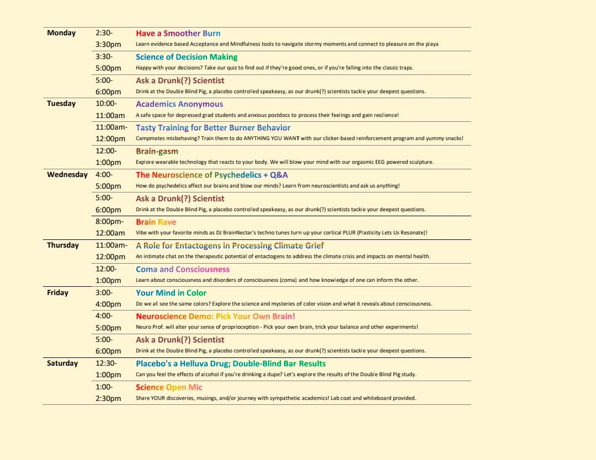
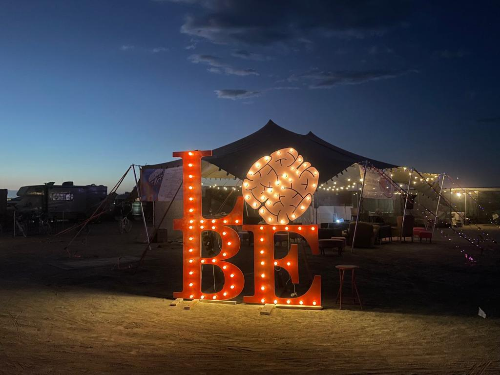
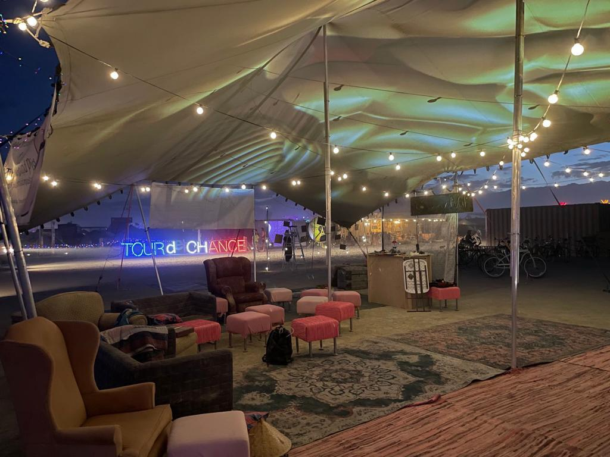

---
#
# By default, content added below the "---" mark will appear in the home page
# between the top bar and the list of recent posts.
# To change the home page layout, edit the _layouts/home.html file.
# https://jekyllrb.com/docs/themes/#overriding-theme-defaults
#
layout: page
---

<!-- 
<b>Find us at <a href="https://www.google.com/maps/d/viewer?mid=1IGnBpMKyclYjKZvhw9HQokDkeWAqBXhf&ll=40.78216363391222%2C-119.19619796311491&z=19">2:30 & A</a></b>
 -->

Our favorite fiber tract, the Campus Callosum, is going back to Burning Man this year and looking to form new connections!

Hypothesis: Scientifically rigorous yet playful activities enhance your burn.

Intro: Our science-themed camp, Campus Callosum, is hosting interactive demos, games, workshops, science art, and Q&As… and we want YOUR BRAIN!

Specific Aims:

AIM 1) Founded by neuroscientists and friends, we have a ton of brainy events! Check out our interactive neurotech, operant conditioning games, and expert-led chats on the neuroscience of drugs, the mind and more.

AIM 2) Our speakeasy 'The Double-Blind Pig' is serving placebo-controlled refreshments. Drop in for "Ask a Drunk Scientist" to help us answer the all the questions that emerge from the dust and test your own ability to discern your sobriety.

Don‘t forget to have a look at our scientifically-inspired art projects on your way out!

## Schedule

<!-- ## Schedule

| Date      | Time   | Event                                         |
| --------- | ------ | --------------------------------------------- |
| Monday    | 3–4pm  | Tasty Training for Better Burner Behavior     |
|           | 4–5pm  | Working overtime to keep up with the Joneses? |
|           | 5–6pm  | Science Open Mic                              |
| ------    | ------ | -------                                       |
| Tuesday   | 3–4pm  | Neurotech Chat                                |
|           | 4–5pm  | Hands-on with Machine-Brain Interfaces        |
|           | 5–6pm  | Ask a Drunk(?) Scientist!                     |
| ------    | ------ | -------                                       |
| Wednesday | 3–4pm  | "Small talk": Brain waves                     |
|           | 4–5pm  | The Neuroscience of Psychedelics              |
|           | 5–6pm  | Planetary Health                              |
| ------    | ------ | -------                                       |
| Thursday  | 3–4pm  | Where is my love potion No.9?                 |
|           | 4–5pm  | Consciousness and the Brain                   |
|           | 5–6pm  | Ask a Drunk(?) Scientist!                     |
| ------    | ------ | -------                                       |
| Friday    | 3–4pm  | Science Open Mic                              |
|           | 4–5pm  | The Neuroscience of Consent                   |
|           | 5–6pm  | Ask a Drunk(?) Scientist!                     |
|           | 7–8pm  | Sunset poetry reading                         | -->

## Photos

<!-- ## Find us

<iframe src="https://www.google.com/maps/d/embed?mid=1IGnBpMKyclYjKZvhw9HQokDkeWAqBXhf&ll=40.78216363391222%2C-119.19619796311491&z=18" width="752" height="480"></iframe> -->

## Contact us

Write us an email at [campuscallosum.org@gmail.com](mailto:campuscallosum.org@gmail.com)

Look at us on [Instagram](https://www.instagram.com/campus_callosum/)

Join us on [Facebook](https://www.facebook.com/groups/358258066489269/)
