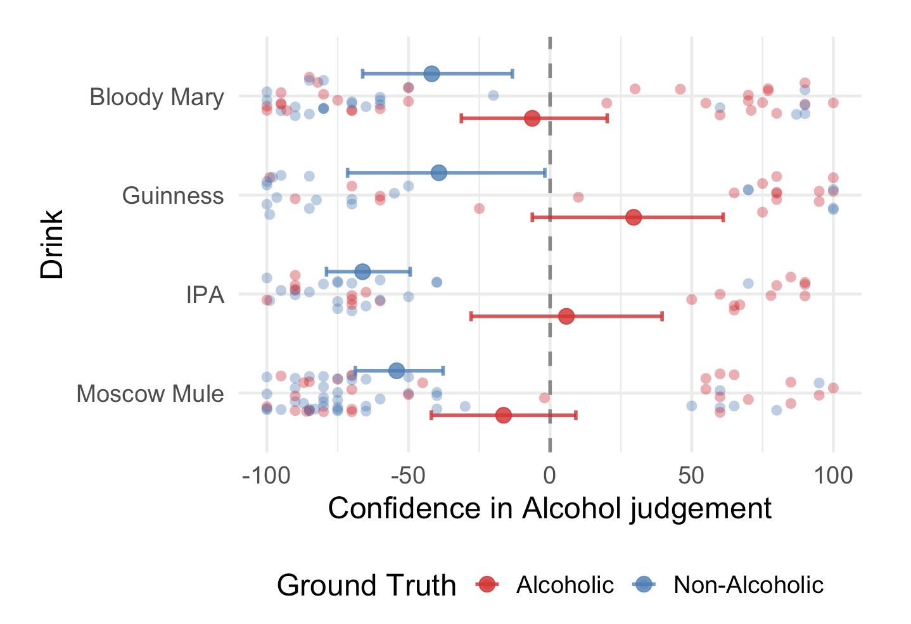
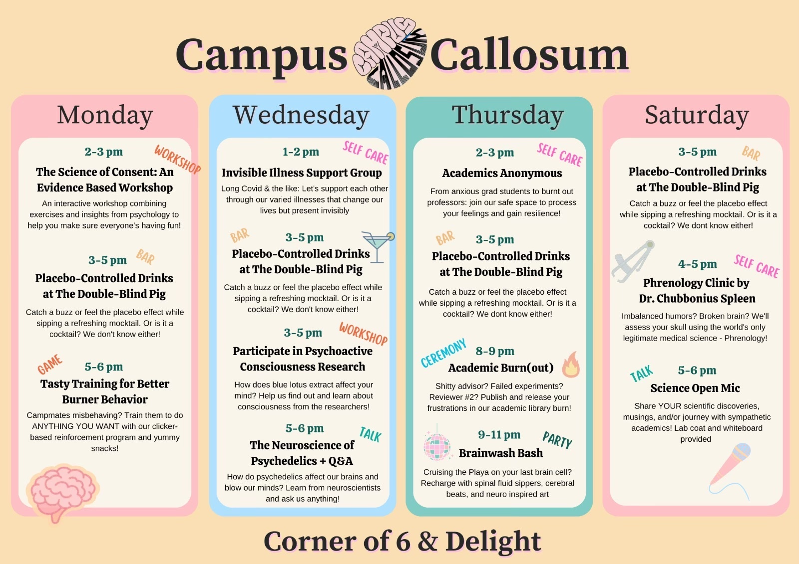
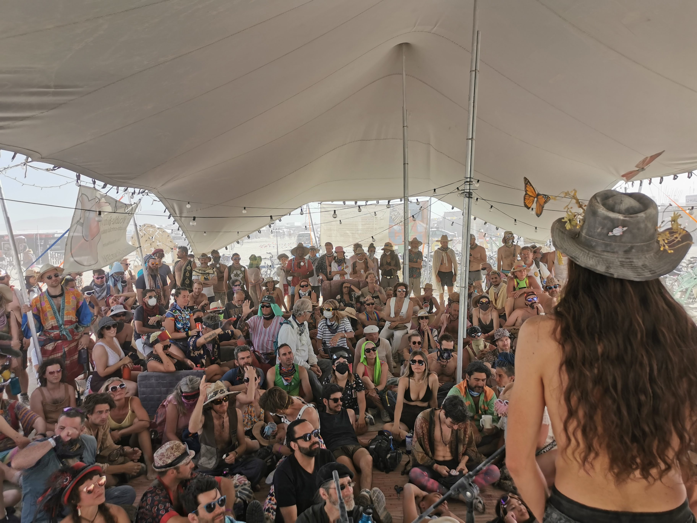
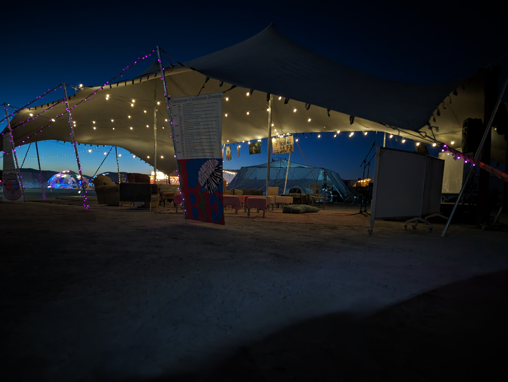

---
#
# By default, content added below the "---" mark will appear in the home page
# between the top bar and the list of recent posts.
# To change the home page layout, edit the _layouts/home.html file.
# https://jekyllrb.com/docs/themes/#overriding-theme-defaults
#
layout: page
---

### Double Blind Pig 2024 Analysis
Interested in this years study? See the results [here](https://camrobjones.com/static/etc/dbp_analysis_2024.html)!

## Mission

### Hypothesis
Scientifically rigorous yet playful participation enhances your burn.

### Intro
Campus Callosum invites you to experiment with our placebo bar, sci-art and brain-inspired activities. 

### Specific Aims

#### AIM 1
Are you drunk!? Our speakeasy The Double-Blind Pig serves placebo-controlled refreshments. While you sip, ask the local (inebriated?) scientists all your burning questions (results may vary)

#### AIM 2
Can we tickle your brain!? Play with our interactive neurotech, mind-stretching games, and discover the neuroscience of your favorite drugs!

#### AIM 3
Ready to blow your mind!? We’re not just nerds, we’re artists too! Study our scientifically inspired pieces co-created by neuroscientists and friends. 

### Summary
WE WANT YOUR BRAINS to test our innovative approach to nerdy fun on the playa!

# Past Years
## Campus Callosum 2024

## Campus Callosum 2023
### Schedule

| Day       | Time    | Event                                             |
| --------- | ------- | ------------------------------------------------- |
| Monday    | 2:30pm  | Have a Smoother Burn                              |
|           | 3:30pm  | Science of Decision Making                        |
|           | 5:00pm  | Ask a Drunk(?) Scientist                          |
| Tuesday   | 10:00am | Academics Anonymous                               |
|           | 11:00am | Tasty Training for Better Burner Behavior         |
|           | 12:00pm | Brain-gasm                                        |
| Wednesday | 4:00pm  | The Neuroscience of Psychedelics + Q&A            |
|           | 5:00pm  | Ask a Drunk(?) Scientist                          |
|           | 8:00pm  | Brain Rave                                        |
| Thursday  | 11:00am | A Role for Entactogens in Processing Climate Grief |
|           | 12:00pm | Coma and Consciousness                            |
| Friday    | 3:00pm  | Your Mind in Color                                |
|           | 4:00pm  | Neuroscience Demo: Pick Your Own Brain!           |
|           | 5:00pm  | Ask a Drunk(?) Scientist                          |
| Saturday  | 12:30pm | Placebo's a Helluva Drug: Double-Blind Bar Results|
|           | 1:00pm  | Science Open Mic                                  |

### Photos 

## Campus Callosum 2022
### Schedule

| Date      | Time   | Event                                         |
| --------- | ------ | --------------------------------------------- |
| Monday    | 3–4pm  | Tasty Training for Better Burner Behavior     |
|           | 4–5pm  | Working overtime to keep up with the Joneses? |
|           | 5–6pm  | Science Open Mic                              |
| ------    | ------ | -------                                       |
| Tuesday   | 3–4pm  | Neurotech Chat                                |
|           | 4–5pm  | Hands-on with Machine-Brain Interfaces        |
|           | 5–6pm  | Ask a Drunk(?) Scientist!                     |
| ------    | ------ | -------                                       |
| Wednesday | 3–4pm  | "Small talk": Brain waves                     |
|           | 4–5pm  | The Neuroscience of Psychedelics              |
|           | 5–6pm  | Planetary Health                              |
| ------    | ------ | -------                                       |
| Thursday  | 3–4pm  | Where is my love potion No.9?                 |
|           | 4–5pm  | Consciousness and the Brain                   |
|           | 5–6pm  | Ask a Drunk(?) Scientist!                     |
| ------    | ------ | -------                                       |
| Friday    | 3–4pm  | Science Open Mic                              |
|           | 4–5pm  | The Neuroscience of Consent                   |
|           | 5–6pm  | Ask a Drunk(?) Scientist!                     |
|           | 7–8pm  | Sunset poetry reading                         |

### Photos

<!-- ## Find us

<iframe src="https://www.google.com/maps/d/embed?mid=1IGnBpMKyclYjKZvhw9HQokDkeWAqBXhf&ll=40.78216363391222%2C-119.19619796311491&z=18" width="752" height="480"></iframe> -->

# Contact us

Write us an email at [campuscallosum.org@gmail.com](mailto:campuscallosum.org@gmail.com)

Look at us on [Instagram](https://www.instagram.com/campus_callosum/)

Join us on [Facebook](https://www.facebook.com/groups/358258066489269/)
